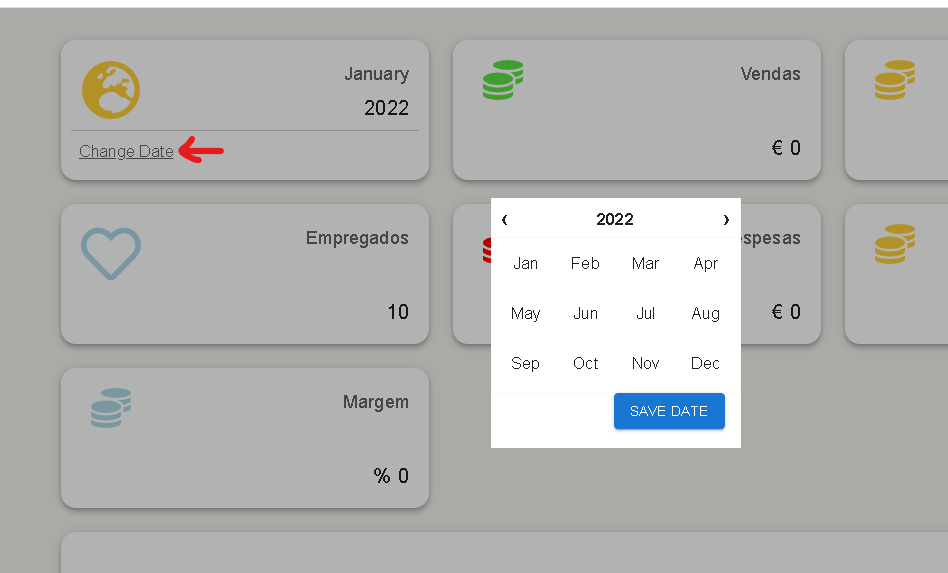

 

---

```diff
-Documento Traduzido de Word para markdown,
-parte da formatação não é compativel.
```

---

JOÃO PAULO PINTO DOS SANTOS | **RELATÓRIO DE ESTÁGIO - VIRTUALNAUTA** <br>
<br> Relatório de estágio de Licenciatura em Engenharia Informática<br>Ramo de Engenharia de Software |
<br><br> **ORIENTADOR**<br>Professora Rossana Santos
<br><br>**SUPERVISOR**<br>CEO Luís Marques<br><br>
2022

---

**RELATÓRIO DE ESTÁGIO - VIRTUALNAUTA**
<br><br>Documento apresentado como requisito parcial para a obtenção do Grau de Licenciado em Engenharia Informática.
<br><br>JOÃO PAULO PINTO DOS SANTOS<br><br>
**JÚRI:**<br>Presidente - Doutora Martinha do Rosário Fonseca Piteira
<br>Arguente - Especialista Cédric Claude Bernard Grueau
<br>Orientador - Professora Rossana Santos
<br>Supervisor - CEO Luís Ferreira - Virtualnauta, Lda.

---


**Resumo**

Este Relatório de estágio foi realizado no âmbito da Unidade Curricular de Estágio da Licenciatura em Engenharia informática, Ramo de Engenharia de Software. O estágio teve uma duração de 486 horas e decorreu entre 28 de julho e 24 de outubro de 2021.

O Aluno foi acolhido pela entidade Virtualnauta Lda., uma empresa maioritariamente focada em desenvolver soluções de automação de processos. Esta empresa é normalmente associada com o seu software Saft Online, este software é uma ferramenta de gestão de obrigações fiscais comercializado e distribuído segundo o modelo "_Software as a_ _service_" a contabilistas e gabinetes de contabilidade, Saft Online é uma ferramenta revolucionária e líder num mercado pouco explorado.

No decorrer do estágio o aluno participou principalmente em dois projetos:

- Desenvolver uma extensão de _browser_ com o intuído de fornecer aos contabilistas uma forma fácil, rápida e segura de automaticamente entrarem nas contas dos seus clientes em _websites_ como o da Autoridade Tributaria e Segurança Social, esta extensão foi realizada utilizando HTML, CSS e JavaScript e o _backend_ foi feito em .Net C# utilizando o padrão de software _model __-__ view __-__ controller_ e conectado à base de dados da empresa utilizando Entity Framework.
- Desenvolver uma aplicação para os clientes dos contabilistas que facilite a comunicação entre contabilistas e clientes. Esta aplicação também deve permitir que as empresas tenham acesso a todos os seus dados fiscais e estatísticas de forma a melhor visualizar o estado da empresa, a aplicação foi desenvolvida em .Net C# com _frontend_ em Javascript, CSS e React, a base de dados foi feita em SQL Server, um projeto de conceito foi providenciado ao aluno como base de começo.

Perto do termino do estágio, o aluno também ficou responsável por pesquisar sobre novas tecnologias e avaliar a sua utilidade para a empresa e, por fim, o aluno participou num terceiro projeto com o objetivo de construir um centro de comunicação em Twilio Flex e React.

**Palavras-chave: ** Virtualnauta, .Net, React, RPA, SQL Server

**Abstract**

This internship report was conducted within the scope of the Internship Curricular Unit of the Degree in Computer Science Engineering, Software Engineering branch. The internship had a duration of 486 hours and took place between July 28th and October 24th, 2021.

The student was hosted by Virtualnauta Lda., a company mostly focused on developing process automation solutions. This company is usually associated with its Saft Online software, this software is a tax obligation management tool marketed and distributed under the "Software as a service" model to accountants and accounting firms, Saft Online is a revolutionary and leading tool in a little explored market.

During the internship the student participated mainly in two projects:

- Developing a browser extension with the intent of providing accountants with an easy, fast, and secure way to automatically enter their clients' accounts on websites such as the Tax Authority and Social Security, this extension was made using HTML, CSS, JavaScript, and the backend was made in .Net C# using the model-view-controller software pattern and connected to the company's database using Entity Framework.
- Developing an application for accountants' clients that facilitates communication between accountants and clients. This application should also allow companies to have access to all their tax data and statistics in order to better visualize the company's status, the application was developed in .Net C# with frontend in JavaScript, CSS and React, the database was made in SQL Server, a concept project was provided to the student as a starting basis.

Towards the end of the internship, the student was also responsible for researching new technologies and evaluating their usefulness for the company, and finally the student participated in a third project with the goal of building a communication center in Twilio Flex and React.

**Keywords**: Virtualnauta, .Net, React, RPA, SQL Server

**Índice**

#

**[Lista de Figuras iv](#_Toc93661474)**

**[Lista de Tabelas vi](#_Toc93661475)**

**[Lista de Siglas e Acrónimos vii](#_Toc93661476)**

**[1.](#_Toc93661477)****Introdução 1**

**[2.](#_Toc93661478)****Apresentação da entidade 4**

**[3.](#_Toc93661479)****Fundamentos teóricos do trabalho 5**

[3.1.Tecnologias Utilizadas 5](#_Toc93661480)

[3.2.Metodologias de desenvolvimento 13](#_Toc93661481)

**[4.](#_Toc93661482)****Descrição do trabalho realizado 18**

[4.1.Visão Geral do Estágio 18](#_Toc93661483)

[4.2.Cronograma 20](#_Toc93661484)

[4.3.Atividades Realizadas 23](#_Toc93661485)

**[5.](#_Toc93661486)****Resultados e Discussão 48**

[5.1.Extensão de _browser_ 48](#_Toc93661487)

[5.2.Aplicação Web Zenconta 49](#_Toc93661488)

[5.3.Centro de contactos 49](#_Toc93661489)

**[6.](#_Toc93661490)****Conclusão 50**

**[7.](#_Toc93661491)****Referências 51**

**[8.](#_Toc93661492)****Glossário 53**

**[9.](#_Toc93661493)****ANEXO A – Plano de Estágio 54**

# Lista de Figuras

[Figura 1 Logótipo da empresa Virtualnauta Lda. 4](#_Toc93661501)

[Figura 2 Logótipo da ferramenta Saft Online 4](#_Toc93661502)

[Figura 3 Logótipo da ferramenta Postman 6](#_Toc93661503)

[Figura 4 Logótipo do software SQL Server Management Studio 6](#_Toc93661504)

[Figura 5 Logótipo do IDE Visual Studio Code 7](#_Toc93661505)

[Figura 6 Logótipo do IDE Visual Studio 7](#_Toc93661506)

[Figura 7 Logótipo da biblioteca Swagger UI 7](#_Toc93661507)

[Figura 8 Logótipo da framework .Net 8](#_Toc93661508)

[Figura 9 Logótipo da framework React 9](#_Toc93661509)

[Figura 10 Logótipo da biblioteca React Redux 10](#_Toc93661510)

[Figura 11 Logótipo da _framework_ NextJS 10](#_Toc93661511)

[Figura 12 Logótipo da framework RasaAI 11](#_Toc93661512)

[Figura 13 Logótipo do software Twilio Flex 11](#_Toc93661513)

[Figura 14 Logótipo do software TortoiseSVN 12](#_Toc93661514)

[Figura 15 Logótipo do software Git 12](#_Toc93661515)

[Figura 16 Logótipo da aplicação GitHub 12](#_Toc93661516)

[Figura 17 Logótipo da ferramenta Diagrams.net 15](#_Toc93661517)

[Figura 18 Logótipo da ferramenta Visual Paradigma 15](#_Toc93661518)

[Figura 19 Logótipo de Azure Devops 16](#_Toc93661519)

[Figura 20 Logótipo do software Google Documents 16](#_Toc93661520)

[Figura 21 Logótipo do software Google Chat 17](#_Toc93661521)

[Figura 22 Extensão protótipo - exemplo de código 24](#_Toc93661522)

[Figura 23 Resultado final da página de _login_ da extensão 25](#_Toc93661523)

[Figura 24 Função para gerar _tokens_ 26](#_Toc93661524)

[Figura 25 Diagrama de sequência do processo de _login_ 26](#_Toc93661525)

[Figura 26 Diagrama de sequência de um pedido ao _web service_ 27](#_Toc93661526)

[Figura 27 Resultado final do sistema de _login_ automático da extensão 27](#_Toc93661527)

[Figura 28 Extensão – pedido de dados de entrada ao servidor 28](#_Toc93661528)

[Figura 29 Extensão – abertura de uma nova página 28](#_Toc93661529)

[Figura 30 Extensão – função que é normalmente injetada para preencher um formulário 29](#_Toc93661530)

[Figura 31 Exemplo de um _endpoint_ do _web service_ da extensão 29](#_Toc93661531)

[Figura 32 Exemplo de uma subclasse guardada no _backend_ 30](#_Toc93661532)

[Figura 33 Extensão - publicação na loja 31](#_Toc93661533)

[Figura 34 Aplicação _web_ Zenconta 32](#_Toc93661534)

[Figura 35 Comparação de conexões à base de dados 35](#_Toc93661535)

[Figura 36 _Endpoint_ de criação de convites de registo 36](#_Toc93661536)

[Figura 37 Formulário de registo 36](#_Toc93661537)

[Figura 38 _Pop-up_ de seleção de data 37](#_Toc93661538)

[Figura 39 Gráficos de desempenho 38](#_Toc93661539)

[Figura 40 Menu de gestão de utilizadores 39](#_Toc93661540)

[Figura 41 Menu de adição de utilizadores 39](#_Toc93661541)

[Figura 42 Solução _auto logout_ 40](#_Toc93661542)

[Figura 43 Zenconta React _login_ 43](#_Toc93661543)

[Figura 44 Zenconta React alteração de data 44](#_Toc93661544)

[Figura 45 Zenconta React página inicial 44](#_Toc93661545)

[Figura 46 Zenconta React _Inbox_ 45](#_Toc93661546)

[Figura 47 Zenconta React gestão de utilizadores 45](#_Toc93661547)

[Figura 48 Zenconta React adição de utilizadores 46](#_Toc93661548)

[Figura 49 Zenconta React pop-up de detalhes 46](#_Toc93661549)

[Figura 50 Zenconta React pop-up de visualização de documentos 47](#_Toc93661550)

# Lista de Tabelas

[Tabela 1 Scrum versus Kanban 14](#_Toc93661551)

# Lista de Siglas e Acrónimos

API _Application Programming interface_

CSS _Cascading Style Sheets_

HTML _HyperText Markup Language_

HTTP _Hypertext Transfer Protocol_

JSON _JavaScript Object Notation_

JSX _JavaScript Syntax Extension_

SAFT _Standard Audit File for Tax Purposes_

UML _Unified Modeling Language_

1.
# Introdução

Este documento representa um relatório de Estágio do Instituto Politécnico de Setúbal da Licenciatura em Engenharia Informática, Ramo de Software.

A escolha da entidade de estágio Virtualnauta Lda. deveu-se ao interesse do aluno em automatização robótica de processos.

O estágio teve uma duração de 486 horas e decorreu entre 28 de julho e 24 de outubro de 2021.

O estágio tem como objetivo proporcionar ao aluno uma experiência no mercado de trabalho e permitir ao mesmo desenvolver competências profissionais e aplicar o conhecimento que lhe foi transmitido ao longo dos três anos do seu curso.

Durante as três primeiras semanas de estágio o aluno ficou responsável de criar uma extensão de _browser_ que permitisse aos clientes da empresa (gabinetes de contabilidade) entrarem automaticamente nas contas dos _websites_ que utilizam no seu dia a dia, como por exemplo o _website_ da Autoridade Tributária e da Segurança Social. Como cada gabinete de contabilidade tem um grande número de empresas clientes é complicado e requer bastante tempo a gestão de contas dos seus clientes, o objetivo desta extensão é permitir a gestão destas contas com apenas alguns cliques. Os contabilistas teriam de fazer _login_ na extensão utilizando a sua conta de Saft Online (ferramenta principal da empresa onde o estágio decorreu) e a partir dai teriam uma lista de seleção com todos os seus clientes. Após selecionarem a empresa cliente são mostrados os ícones de todos os _websites_ em que existe uma conta presente na base de dados, para entrar automaticamente em um dos _websites_ utilizando a conta da entidade selecionada o utilizador apenas tem de clicar no ícone do _website_.

A extensão de _browser_ foi feita utilizando HTML, JavaScript e CSS.

O _web service_ que representa o _backend_ da extensão foi feito em .Net e conectado à base de dados da empresa em T-SQL.

Após a primeira versão da extensão ter sido publicada na loja de extensões da Google foi atribuído um novo projeto ao aluno, o objetivo deste projeto era o desenvolvimento de uma aplicação _web_ com o nome de Zenconta.

Os utilizadores finais desta aplicação _web_ seriam as empresas clientes dos gabinetes de contabilidade, sendo a aplicação _web_ fornecida aos gabinetes de contabilidade para oferecerem ou venderem aos seus clientes como extra aos seus serviços.

Esta aplicação serviria para melhorar a comunicação entre gabinetes de contabilidade e os seus clientes, e permitir às empresas terem uma melhor visão sobre o estado atual da empresa, conseguindo ver estatísticas relevantes, como por exemplo o desenvolvimento do lucro, despesas, impostos e pessoal ao longo do tempo. As empresas também poderiam consultar e submeter todos os documentos necessários como por exemplo todas as EFaturas, estado dos veículos da empresa e taxas a pagar sobre os mesmos, todos os SAFTs e também um _chat_ por onde comunicar com os contabilistas.

Foi dado ao aluno um projeto conceito em .Net como base por onde começar, este projeto já vinha com um _frontend_ montado a partir de um _template_ e uma API com alguns _endpoints_ no _backend_. Porém, este projeto vinha com alguns problemas de estrutura e segurança no _backend_, e o _frontend_ não utilizava nenhuma biblioteca e estava apenas escrito em JavaScript e HTML. Devido aos problemas neste projeto conceito, grande parte do _backend_ teve de ser refeita e posteriormente foi concluído que teria sido mais rápido ter começado um projeto novo, nas últimas semanas do estágio o aluno desenvolveu um novo _frontend_ em React para substituir o anterior.

A aplicação _web_ Zenconta foi desenvolvida utilizando .Net, HTML, JavaScript, CSS e T-SQL para a base de dados de acordo com o projeto conceito dado ao aluno, posteriormente também foi utilizado React.

O terceiro projeto em que o aluno participou seria fazer um centro de contactos a partir da aplicação Twilio Flex (centro de contactos 100% personalizável utilizando React), foram dados cerca de três dias ao aluno para aprender e se adaptar à biblioteca React de forma a conseguir realizar este projeto.

O projeto de construir um centro de contactos acabou por ser considerado um insucesso, do ponto de vista do aluno, no sentido em que com o tempo restante de estágio (cerca de semana e meia) não seria possível concluir este projeto por uma grande margem. O aluno também experienciou algumas dificuldades dado que apenas teria começado a utilizar React recentemente.

Apos alguns dias a trabalhar no centro de contactos o aluno sugeriu ao seu supervisor que fosse transferido para outro projeto, o qual tivesse a oportunidade de concluir antes do fim do estágio, foi então atribuído ao aluno o projeto de refazer o _frontend_ da aplicação Zenconta em React.

Ao longo do desenvolvimento do segundo e terceiro projeto o aluno esteve ao mesmo tempo a fazer novas funcionalidades que iam sendo pedidas pelos clientes para a extensão de _browser_.

A metodologia ágil que foi utilizada no decorrer do estágio foi o Kanban devido ao aluno trabalhar maioritariamente sozinho ou numa equipa de apenas duas pessoas (aplicação _web_ Zenconta).

O Aluno também teve a oportunidade de ter mini projetos para explorar novas tecnologias e avaliar a utilidade das mesmas para a empresa, estas tecnologias foram, Rasa AI que é uma framework para criar _chat bots_ e NextJS que é uma _framework_ de desenvolvimento baseada em React.

Em Rasa AI apenas foi realizado um pequeno programa de teste e em NextJS foi feita uma pequena página _web_ enquanto o aluno aprendia React.

No capítulo dois deste documento o aluno irá falar brevemente sobre a entidade acolhedora Virtualnauta Lda.

No capítulo três irão ser descritas e explicadas as tecnologias utilizadas ao longo do estágio e a metodologia de desenvolvimento ágil escolhida.

No quarto capítulo será falado sobre o cronograma, projetos em que o aluno esteve envolvido e descrição das tarefas realizadas.

No capítulo cinco será falado sobre os resultados obtidos e a discussão dos mesmos.

Por fim, no capítulo seis será feita a conclusão sobre o estágio realizado pelo aluno.

1.
# Apresentação da entidade

O Aluno foi acolhido pela entidade Virtualnauta Lda., uma pequena empresa com apenas cerca de dez trabalhadores que foi fundada em 2007.

Esta empresa foca-se maioritariamente em desenvolver soluções de automação de processos e é normalmente associada ao seu software principal Saft Online, este software é uma ferramenta de gestão de obrigações fiscais comercializado e distribuído segundo o modelo SaaS (Software as a Service) a contabilistas e gabinetes de contabilidade.

A ferramenta Saft Online é uma das melhores no seu mercado de vendas devido a este ser um mercado pouco explorado e com pouca concorrência ou concorrência sem o mesmo nível de desenvolvimento e funcionalidades.

Esta ferramenta automatiza muitas das tarefas repetitivas presentes no trabalho de um contabilista, permitindo um nível de produtividade muito maior ao normalmente possível.

Enquanto um gabinete de contabilidade que realize todas as suas tarefas manualmente consegue ter cerca de três ou quatro clientes por funcionário, outro gabinete de contabilidade que esteja mais atualizado tecnologicamente, consegue ter um numero muitas vezes superior de clientes por funcionário.

Segundo a visão do aluno, automação robótica de processos será cada vez mais comum, automatizando o trabalho de cada vez mais profissões.

As empresas que não se conseguirem adaptar deixaram rapidamente de conseguir competir na sua área de trabalho.


Figura 1 Logótipo da empresa Virtualnauta Lda.


Figura 2 Logótipo da ferramenta Saft Online

1.
# Fundamentos teóricos do trabalho

## 3.1.Tecnologias Utilizadas

### 3.1.1.Linguagens

#### Javascript

Javascript é uma linguagem de programação de alto nível maioritariamente utilizada para o desenvolvimento e funcionamento de aplicações em _browsers_ (um total de 97% dos _websites_ utilizam Javascript) [1].

Esta linguagem foi utilizada durante o estágio para programar as funcionalidades da extensão de _browser_ assim como adicionar funcionalidade ao _frontend_ da aplicação "Zenconta" e posteriormente refazer a mesma utilizando React. Por fim, esta linguagem foi utilizada para desenvolver um projeto de Twilio Flex (centro de contactos).

#### C#

C# é uma linguagem de programação orientada a objetos desenvolvida pela Microsoft em 2000 e é uma linguagem que é versátil para o desenvolvimento de aplicações, pois permite a fácil integração com outras _frameworks_ (sendo algumas delas desenvolvidas e suportadas pela Microsoft, e.g. Asp.net, .Net) [2].

No estágio a _framework_ utilizada foi .Net para fazer o _backend_ da extensão para o _browser_ Chrome e para fazer o _backend_ da aplicação Zenconta.

#### T-SQL (Transact Structured Query Language)

SQL (Structured Query Language) é uma linguagem utilizada para contruir e gerir bases de dados relacionais através de comandos. T-SQL é uma extensão de SQL que adiciona algumas novas funcionalidades como programação procedimental e variáveis locais [3].

Esta linguagem foi escolhida por ser a linguagem em que a base de dados da empresa já se encontrava.

O aluno utilizou esta linguagem em conjunto com a ferramenta SQL Server Management Studio da Microsoft para desenvolver e gerir as bases de dados necessárias aos projetos dos quais esteve envolvido.

### 3.1.2.Ferramentas

#### Postman

Postman é uma ferramenta que simplifica o processo de testar APIs. Esta ferramenta permite ao programador simular pedidos HTTP (Protocolo de Transferência de Hipertexto) e observar as respostas da API aos mesmos [4].


Figura 3 Logótipo da ferramenta Postman

#### SQL Server Management Studio

Este software é um ambiente de desenvolvimento criado pela Microsoft para gerir infraestruturas de bases de dados, esta ferramenta permite aceder, configurar e gerir bases de dados relacionais.

A linguagem de programação utilizada por neste ambiente de desenvolvimento é o T-SQL (Transact Structured Query Language).


Figura 4 Logótipo do software SQL Server Management Studio

#### Visual Studio Code

O Visual Studio Code é um editor de código _open source_ que, apesar de não exigir muitos recursos de um computador, pode ser utilizado com um grande número de linguagens de programação. Este editor de código também contém uma loja de extensões permitindo uma grande adaptabilidade e customização do mesmo [5].

Este software foi escolhido pela sua flexibilidade e foi utilizado pelo aluno no desenvolvimento da extensão de _browser_ e projetos em React.


Figura 5 Logótipo do IDE Visual Studio Code

#### Visual Studio

Visual Studio é um ambiente de desenvolvimento criado pelo Microsoft, normalmente utilizado para desenvolver aplicações .Net. [6]


Figura 6 Logótipo do IDE Visual Studio

### 3.1.3.Frameworks, Bibliotecas e Plataformas

#### Swagger UI

Swagger UI é uma biblioteca que permite aos programadores testarem _endpoints_ de uma API antes da mesma estar ligada a um _frontend_, sendo possível simular pedidos e observar a resposta da API aos mesmos [7].


Figura 7 Logótipo da biblioteca Swagger UI

#### .Net

.Net é uma _framework_ multiplataforma _open source_ de desenvolvimento de sistemas e aplicações [8].

Como sendo a _framework_ padrão de desenvolvimento de _backend_ pela empresa, o aluno teria acesso a projetos anteriores e projetos conceito por onde se guiar. Como tal, esta _framework_ foi utilizada pelo aluno em todo o desenvolvimento de _backend_ no decorrer do estágio.

Num dos projetos em que o aluno participou, foi necessário reestruturar e continuar o desenvolvimento de um projeto conceito, já desenvolvido utilizando esta _framework_.

#### Vantagens

- Excelente performance e otimização.
- Programação orientada a objetos.
- Multiplataforma.

#### Desvantagens

- Custo de licenças.

#### Tecnologias alternativas

A tecnologia alternativa que é normalmente utilizada no _backend_ é o Java, não seria justo dizer que uma é melhor que a outra, visto que ambas tem pontos fortes e situações em que são mais apropriadas dependendo dos requisitos do projeto, Java consegue correr em qualquer plataforma, mas necessita de mais cuidados para garantir a segurança de uma API, em .Net o código de uma API é normalmente melhor estruturado seguindo uma estrutura padrão.

Ambas a tecnologias são uma ótima escolha e cabe à equipa de desenvolvimento ver qual se adapta melhor ao projeto [9].


Figura 8 Logótipo da framework .Net

#### React

React é uma biblioteca de JavaScript utilizada para construir o _frontend_ de aplicações _web_ através de um sistema baseado em componentes, permitindo uma grande flexibilidade e redução de código repetido, visto que após um componente estar feito, este pode ser reutilizado como se fosse um bloco de Lego na mesma aplicação ou até em aplicações futuras.

O aluno utilizou esta biblioteca durante um curto período de tempo num projeto conceito para desenvolver um centro de contactos utilizando Twilio Flex, dado que esta plataforma requer um _frontend_ em React para o seu desenvolvimento.

Mais tarde o aluno teve a oportunidade de escolher uma biblioteca de _frontend_, com o propósito de refazer e adaptar o _frontend_ da aplicação "Zenconta". O aluno escolheu React de forma a desenvolver os seus conhecimentos nesta biblioteca.

#### Vantagens

- Fácil reutilização de componentes.
- Biblioteca de _frontend_ popular com bastante documentação e suporte.
- _Deploy_ fácil e rápido.

#### Desvantagens

- Sintaxe de JSX, onde é misturado HTML com JavaScript .

#### Tecnologias alternativas

Uma alternativa a React seria a biblioteca Angular, estas duas bibliotecas são as bibliotecas de _frontend_ mais utilizadas no mercado. A escolha entre as duas deve ser realizada com base nos requisitos do projeto. Os fatores mais decisivos para optar por React são ser a biblioteca mais rápida e com maior compatibilidade entre versões [10].


Figura 9 Logótipo da framework React

#### React Redux

React Redux é uma biblioteca que ajuda a gerir o estado de uma aplicação em React, ou seja, guardar e aceder informação guardada em diferentes níveis de componentes dentro da aplicação.


Figura 10 Logótipo da biblioteca React Redux

#### NextJS

NextJS é uma _framework_ de desenvolvimento baseada em React que integra um grande número de novas funcionalidades revolucionárias no mercado, como por exemplo _server-side rendering_ em que a página é totalmente gerada no _backend_ e apenas fornecida ao utilizador.

Um exemplo prático seria um _website_ de notícias, onde poderia ser gerada uma página HTML no _backend_, onde a cada cinco minutos seria atualizada com as notícias mais recentes. Ao contrário de um _website_ normal, onde por cada utilizador a aceder à página teria de ser feito um pedido extra ao servidor, a pedir a lista de notícias para poder popular o _frontend_, com esta tecnologia o número de pedidos realizados ao servidor diminui drasticamente.

O aluno realizou um projeto de conceito utilizando esta _framework_ no seu processo de aprendizagem de React.


Figura 11 Logótipo da _framework_ NextJS

#### Rasa AI

Rasa é uma _framework_ de criação de _chat bots_ através de redes neuronais treinadas através de regras e exemplos dados pelo programador. Esta _framework_ utiliza a linguagem de programação Python [11].

O aluno apenas realizou um pequeno projeto de conceito de forma a analisar a utilidade desta framework para a empresa.


Figura 12 Logótipo da framework RasaAI

#### Twilio Flex

Twilio Flex é um centro de contactos contruído em cima da plataforma de comunicações Twilio Cloud, permitindo uma empresa focar todos os seus contactos de plataformas diferentes numa só plataforma [12]. Este centro de contactos pode ser 100% customizado e expandido. O _frontend_ do mesmo é desenvolvido em React e o software oferece um projeto modelo que serve de ponto de partida para todos os seus clientes. Muitas empresas já obtiveram grande sucesso no mercado a vender versões customizadas deste produto a centros de chamada e a outras atividades comercias.

O objetivo da criação de uma aplicação baseada em Twilio Flex seria vender a mesma como serviço aos clientes da empresa. O estudante esteve envolvido neste projeto durante uma semana.


Figura 13 Logótipo do software Twilio Flex

#### TortoiseSVN

TortoiseSVN é um software de controlo de versões lançado em 2002 [13]. Este software foi utilizado durante as primeiras semanas de estágio por ser o software de controlo de versões em que os projetos da empresa se encontravam guardados, posteriormente começou-se a transferir projetos para o GitHub.


Figura 14 Logótipo do software TortoiseSVN

#### Git e GitHub

Git é um software de gestão de versões, normalmente utilizado de forma a permitir colaboração entre programadores num determinado projeto.

GitHub é uma aplicação que integra o software Git, assim como permite facilitar a gestão de projetos aos seus utilizadores.


Figura 15 Logótipo do software Git


Figura 16 Logótipo da aplicação GitHub

## 3.2.Metodologias de desenvolvimento

Um dos processos mais importantes de um projeto é a decisão de que metodologia de desenvolvimento seguir visto que esta irá ter impacto durante todo o período de desenvolvimento de um projeto e poderá afetar o sucesso ou fracasso do mesmo.

Nos projetos em que o aluno participou na empresa foi escolhida a metodologia de desenvolvimento ágil Kanban, o fator que mais impacto teve nesta escolha foi o tamanho da equipa de desenvolvimento, maioritariamente o aluno trabalhou em projetos sozinho e num projeto de duração de cerca de duas semanas com apenas mais um colega.

### 3.2.1.Kanban

Kanban é uma metodologia de desenvolvimento ágil que funciona como um quadro de tarefas dividido por categorias que representam o estado das mesmas, um exemplo de um quadro simples de Kanban seria:

- To do - Tarefas em espera.
- Doing - Tarefas a serem realizadas.
- Done – Tarefas concluídas.

No início de um ciclo de desenvolvimento utilizando este quadro seriam postas as tarefas a serem realizadas na categoria "To do", quando estas começassem a ser realizadas seriam passadas para a categoria "Doing" e após terminadas para a categoria "Done", permitindo à equipa facilmente ter sempre noção do estado atual de desenvolvimento.

O quadro que o aluno decidiu utilizar foi o seguinte:

- Backlog - tarefas em lista de espera para serem realizadas, estas são ordenadas por prioridade.
- Em Especificação - todas as tarefas em que o seu desenvolvimento foi iniciado, no entanto algum aspeto ficou por ser definido o que impedia a continuação do seu desenvolvimento. Todas as tarefas que estavam em especificação ficam então bloqueadas do desenvolvimento até existir _input_ externo.
- Em Desenvolvimento - tarefas que estão atualmente em desenvolvimento.
- Concluído – tarefas concluídas.

#### Vantagens

- Flexibilidade – Kanban é facilmente adaptável a diversos ciclos de desenvolvimento diferentes dependendo das necessidades do projeto.
- Possibilidade de realizar alterações a meio de um ciclo de desenvolvimento.
- Pode ser utilizado por equipas com um número de membros baixo.
- Melhor visualização do estado atual da aplicação e do processo de desenvolvimento da mesma.

#### Desvantagens

- Não é a metodologia mais adequada para equipas com um elevado número de elementos.

#### Alternativas e comparação

A metodologia ágil alternativa ao Kanban seria o Scrum, enquanto o Kanban segue um ciclo de desenvolvimento continuo o Scrum funciona por _sprints_ estruturados de tamanho e objetivos definidos. Kanban é mais adequado a projetos em que os requisitos podem ter de alterar com frequência, pois podem ser realizadas alterações e adição de tarefas a qualquer altura, já o Scrum tem uma lista de tarefas fixas por _sprint_ e só poderá receber alterações no _sprint_ seguinte. Outra diferença importante é a existência das _Roles_ de "_Product Owner_" e "_Scrum Master_" na metodologia Scrum (Tabela 1 Scrum versus Kanban).

O Aluno optou por seguir a metodologia ágil Kanban por ter trabalhado em equipas de apenas uma ou duas pessoas durante o decorrer do estágio, sendo que Kanban se adapta melhor a equipas pequenas e não necessita de preencher as _Roles_ existentes no Scrum. [14]

Tabela 1 Scrum versus Kanban

|     | Scrum | Kanban |
| --- | --- | --- |
| Ciclos de Desenvolvimento | Sprints de duração fixa | Desenvolvimento. Continuo |
| _Roles_ | _Product Owner_, _Scrum Master_, Equipa de desenvolvimento | Não são necessárias roles |
| Entregas | Entrega no final de cada sprint | Entregas continuas |
| Política de Alterações | Não deveriam ser realizadas Alterações a meio de um sprint | Alterações podem acontecer a qualquer altura |

### 3.2.2.Gestão de tarefas e documentação

#### Diagrams.net

_Diagrams.net_ (posteriormente conhecida como _Draw.io_) é uma ferramenta de desenvolvimento de diagramas _online_, esta plataforma tem uma aplicação _web_ que permite o seu uso em qualquer dispositivo com acesso a um _browser_. [15]

O aluno utilizou esta ferramenta para fazer pequenos diagramas de forma a explicar e planear o funcionamento das aplicações desenvolvidas.


Figura 17 Logótipo da ferramenta Diagrams.net

#### Visual Paradigm

_Visual Paradigm_ é uma ferramenta de _design_ e gestão de sistemas informáticos através da linguagem UML (Linguagem de Modelagem Unificada). [16]

Esta ferramenta permite aos programadores criarem vários tipos de diagrama, como por exemplo, diagramas de estrutura, diagramas de comportamento e diagramas de interação agilizando assim o processo de desenvolvimento de um produto e mantendo uma melhor documentação sobre o mesmo.

O Aluno utilizou esta ferramenta para mapear a interação entre as APIs da empresa e o modelo de base de dados a ser utilizado.


Figura 18 Logótipo da ferramenta Visual Paradigma

#### Azure Devops

Azure Devops é um conjunto de ferramentas desenvolvidas pela Azure para agilizar todo o processo de desenvolvimento de uma aplicação.

As ferramentas Utilizadas do conjunto foram, Azure _Boards_ e Azure _Repos_.

Azure _Boards_ é quadro interativo de planeamento de trabalho que facilita a gestão de tarefas de forma a aumentar a produtividade de uma equipa de desenvolvimento.

Azure Repos é um anfitrião de repositórios de Git privados.

O aluno Utilizou Azure _Boards_ como quadro de Kanban e Azure Repos como repositório da aplicação "Zenconta".


Figura 19 Logótipo de Azure Devops

#### Google Documents e Markdown

Google _Documents_ é um editor de documentos _online_ criado pela Google.

Markdown é uma linguagem de marcação normalmente utilizada para documentação de projetos, o texto de Markdown é convertido em HTML permitindo gerar páginas _web_ de documentação.

Durante o período de estágio o aluno utilizou brevemente Google _Documents_ para fazer a documentação pedida pela empresa acerca dos projetos em que esteve envolvido.


Figura 20 Logótipo do software Google Documents

### 3.2.3.Comunicação

#### Google Chat

O Google Chat (Posteriormente conhecido como _Hangouts_) é um software de comunicação desenvolvido pela Google, esta foi é a ferramenta que a empresa utiliza para comunicação interna.


Figura 21 Logótipo do software Google Chat

1.
# Descrição do trabalho realizado

## 4.1.Visão Geral do Estágio

Durante o período de estágio o aluno participou em três projetos, sendo estes, realizar uma extensão de _browser_, desenvolver uma aplicação _web_ para os clientes dos clientes da entidade onde o aluno estagiou e fazer um centro de contactos através de Twilio Flex.

Para alem destes três projetos o aluno aprendeu React e também realizou pequenos projetos para testar novas tecnologias e avaliar a utilidade das mesmas para a empresa, estas tecnologias foram Rasa AI e NextJS.

### 4.1.1.Extensão de _browser_

O aluno ficou responsável de criar uma extensão de _browser_ que permitisse aos clientes da empresa (gabinetes de contabilidade) acederem automaticamente às contas dos _websites_ que utilizam no seu dia a dia, como cada gabinete de contabilidade por si tem um grande número de empresas clientes o processo de gestão de contas dos seus clientes é complicado e requer bastante tempo. Esta extensão tem como objetivo permitir uma melhor e mais eficiente gestão destas contas.

Após os contabilistas entrarem pela extensão na sua conta têm acesso a uma lista de seleção com todos os seus clientes, após selecionarem a empresa cliente têm acesso aos ícones de todos os _websites_ em que existe uma conta presente na base de dados, para entrar automaticamente em um dos _websites_ utilizando a conta da entidade selecionada o utilizador apenas tem de clicar no ícone do _website_.

Esta extensão de _browser_ foi realizada utilizando HTML, JavaScript e CSS sendo estas as linguagens padrões para criar uma extensão para Chromium (sistema que os _browsers_ Chrome e Edge usam)

O _backend_ da extensão foi feito em .Net e conectado à base de dados da empresa em T-SQL.

### 4.1.2.Aplicação _web_ Zenconta

Esta aplicação tem como objetivo melhorar a comunicação entre gabinetes de contabilidade e os seus clientes, tanto como permitir às empresas terem uma melhor visão sobre o estado atual da empresa, tendo acesso dentro da aplicação a estatísticas representantes do desempenho da empresa, uma forma de comunicação com os contabilistas no formato de um _chat_ e uma forma de introduzir e aceder a todos os seus documentos como por exemplo todas as faturas, estado dos veículos da empresa, taxas a pagar sobre os mesmos e todos os Safts.

Os utilizadores finais desta aplicação _web_ seriam as empresas clientes dos gabinetes de contabilidade.

Este projeto teve como base um projeto conceito feito em .Net, este projeto já vinha com um _frontend_ estático extraído de um modelo encontrado na internet e uma API com alguns _endpoints_, O aluno teve refazer e alterar uma grande parte deste projeto pois o mesmo continha problemas de estruturação e segurança, o aluno também refez completamente o _frontend_ desta aplicação em React e passou o mesmo de páginas estáticas para uma aplicação de página única (Single Page Application) de forma a modernizar a aplicação.

Esta aplicação foi desenvolvida utilizando .Net, HTML, JavaScript, CSS, T-SQL e React.

### 4.1.3.Centro de Contactos Twilio Flex

O terceiro projeto do qual o aluno fez parte foi criar um centro de contactos a partir da aplicação Twilio Flex, esta aplicação é centro de contactos 100% personalizável que utiliza React como _frontend_.

O objetivo desta aplicação seria fornecer a mesma como extra em conjunto com a ferramenta Saft Online aos clientes da empresa onde o estágio foi realizado, os gabinetes de contabilidade poderiam então fornecer esta ferramenta aos seus clientes.

O Aluno estudou React durante cerca de três dias de forma a melhor se adaptar à biblioteca React e conseguir realizar este projeto, porem após cerca de uma semana neste projeto o aluno estava a ter algumas dificuldades em se adaptar ao mesmo e segundo sugestão do aluno voltou para o projeto Zenconta.

## 4.2.Cronograma

#### Semana de 26/07/2021 a 01/08/2021:

- Investigar como extensões de _browser_ funcionam.
- Criação de uma extensão protótipo que faça _login_ num _website_.
- Adaptação do auto _login_ ao _website_ da Autoridade Tributaria.
- Investigar como funciona o processo de publicação de extensões na loja da Google.
- Inicio da criação do sistema de _login_ automático para a extensão.

#### Semana de 02/08/2021 a 08/08/2021

- Estudo da estrutura de Bases de dados da empresa.
- Inicio do desenvolvimento de um _web service_ para a extensão.
- _Login_ Através do _web service._
- Ligação Extensão- _web service._
- Investigação sobre a compatibilidade entre extensões para os _browsers_ "Chrome" e "Edge".
- Revisão da segurança das sessões de utilizadores no _web service_, foi implementado um _token_ com 25 caracteres aleatórios e tempo de vida de quatro horas.

#### Semana de 09/08/2021 a 15/08/2021

- Criação da _User Interface_ para a parte funcional da aplicação.
- Adição de _endpoints_ ao _web service_ para ser possível ir buscar os dados de _login_ de uma entidade nos websites escolhidos pela empresa.
- Transição de toda a informação necessária para o _auto__login_ num _website_ da extensão para o _web service._
- Teste das funcionalidades da extensão.
- Finalização e publicação da versão inicial da extensão na loja da Google.
- Almoço de empresa para promover o trabalho em equipa.

#### Semana de 16/08/2021 a 22/08/2021

- Começo do segundo projeto (aplicação para os clientes dos contabilistas).
- Inicio do estudo do projeto protótipo em que a aplicação vai ser baseada.
- Redução e Correção das permissões necessárias para o funcionamento da extensão.
- Criação de um documento utilizado para explicar o porque da extensão necessitar de cada uma das permissões pedidas para enviar para a Google.
- Documentação de todos os _endpoints_ da API de forma a listar todas as falhas de segurança e o que funciona ou necessita de ser corrigido funcionalmente.
- Inicio da correção das falhas de segurança existentes na aplicação protótipo.

#### Semana de 23/08/2021 a 29/08/2021

- Extensão aceite e publicada na loja.
- Finalização das correções de segurança para a aplicação destinada a clientes dos contabilistas.
- Escolha dos procedimentos de registo de uma empresa.
- Inicio da criação do formulário de registo.
- Inicio do desenvolvimento do controlador de registos da aplicação – _backend_.

#### Semana de 30/08/2021 a 05/09/2021

- Funcionalidade de troca de ano e correção dos gráficos mostrados.
- Reestruturação dos antigos gráficos para dois gráficos simplificados (mensal e percentual mensal) com todas as variáveis (sendo estas clicáveis, permitindo ao utilizador escolher as comparações que quer ver).

#### Semana de 06/09/2021 a 12/09/2021

- Implementação de gestão de utilizadores de uma empresa.
- Teste de todas as funcionalidades previamente implementadas e correção de erros.

#### Semana de 13/09/2021 a 19/09/2021

  - Planeamento de tarefas para a segunda versão da extensão.
  - Transição da extensão e _web service_ da mesma do TortoiseSVN para o GitHub.
  - Aumento do tempo de vida dos _cookies_/_login_ a pedido dos clientes.
  - Adição ao _web service_ de Autenticação um _endpoint_ de autenticação utilizado a base de dados principal.

#### Semana de 20/09/2021 a 26/09/2021

  - Sistema de autenticação e segurança refeitos de forma a utilizar _tokens_ JWT e o _web service_ de autenticação da outra aplicação.
  - Melhoramento visual da interface da extensão e adição de um ecrã de espera enquanto se espera resposta do servidor.
  - Investigação de soluções não prejudiciais ao cliente para realizar auto _logout_ nos _websites_ após o uso dos mesmos.

#### Semana de 27/09/2021 a 03/10/2021

  - Implementação da funcionalidade de Auto Logout através da limpeza de _cookies_.
  - Adição do _website_ "fundos de compensação" à extensão.
  - Publicação da segunda versão a extensão.

#### Semana de 04/10/2021 a 10/10/2021

  - Investigação sobre a _framework_ Rasa.
  - Criação de um projeto de testes utilizando a _framework_ Rasa.
  - Investigação de viabilidade de criação de um _contact center_ utilizando a _framework_ Twilio Flex

#### Semana de 11/10/2021 a 17/10/2021

  - Aprendizagem sobre React, React Redux, React Routing e NextJs.
  - Criação de uma aplicação protótipo em React.
  - Criação de uma aplicação protótipo em NextJs.
  - Adição de funcionalidades ao centro de contactos.

#### Semana de 18/10/2021 a 24/10/2021

  - Transição do _frontend_ da aplicação "Zenconta" de HTML, CSS e Javascript para React.

## 4.3.Atividades Realizadas

#### Como criar uma extensão de browser

Uma extensão de _browser_ é maioritariamente programada em JavaScript.

Extensões são compostas pelos seguintes ficheiros:

  - Manifest.json – ficheiro com todos os detalhes e descrição da extensão.
  - _Scripts_ de Background – código em JavaScript que corre no "_background_" enquanto a extensão esta ligada.
  - _Scripts_ de conteúdo – código que é injetado numa determinada página sempre que esta é aberta de forma a adicionar funcionalidade ou customizar a mesma.
  - Página de _Pop-up_ e uma página de opções (HTML, CSS e JavaScript) – página _web_ que é mostrada quando o utilizador clica no ícone da extensão e página de opções da extensão.

#### Extensão de login protótipo

De forma a iniciar este projeto o aluno começou por seguir o tutorial oficial do manual de desenvolvimento do Google Chrome para criar uma extensão protótipo [17]

Como os objetivos deste projeto ainda não se encontravam bem definidos e o aluno apenas tinha a informação que a extensão seria utilizada para fazer _login_ automaticamente em alguns _websites,_ o aluno começou por criar uma extensão com um _script_ de _background_ que ao detetar que o _website_ desejado acabou de carregar, inseria os valores de utilizador e _password_ nos respetivos elementos da página e então clicaria no botão de submeter.

O _website_ exemplo utilizado nesta fase foi o Google, sendo este é um dos _websites_ mais bem protegidos contra automação. Se fosse possível automatizar este processo para este _website,_ o conceito da extensão seria provado como funcional para praticamente todos os outros.

#### Login automático no website da Autoridade Tributaria

Após ser dada mais informação ao aluno sobre em quais _websites_ a extensão seria utilizada, esta foi preparada para ser utilizada com o _website_ da Autoridade Tributaria.


Figura 22 Extensão protótipo - exemplo de código

#### Processo de publicação de uma extensão

Publicar uma extensão na loja do _Google Chrome_ é um processo simples, após a versão atual da extensão estar completa e a sua informação estiver presente e atualizada no Manifest.json, esta deve ser comprimida e submetida para a loja. O programador deve ter uma conta de programador e tem de preencher um formulário com toda a informação da extensão, assim como um texto a explicar o porquê de requerer cada tipo de permissão utilizada na sua extensão e que será que pedida aos seus utilizadores.

Após a extensão ser submetida, será avaliada pela equipa do Google para verificar se é segura e, só após ser aceite pela mesma, será publicada na loja. Este processo pode demorar entre alguns dias a semanas.

#### Criação de uma User Interface para a extensão protótipo

O aluno criou uma página _Pop-up_ que é apresentada sempre que os utilizadores clicam no ícone da extensão. Nesta altura apenas foram criadas duas caixas de texto e um botão de submeter e adicionado um pouco de CSS.


Figura 23 Resultado final da página de _login_ da extensão

#### Estudo da base de dados da empresa

Como a empresa possuía uma base de dados muito grande, _i.e.,_ com muita informação dos clientes e informação de várias aplicações diferentes, o aluno dedicou algum tempo a entender as ligações existentes entre tabelas, assim como a informação já persistida na base de dados, tentando entender o que seria útil para utilizar na extensão a ser desenvolvida.

O aluno utilizou o _software_ Visual Paradigm para modelar as tabelas da base de dados e a ligação entre as mesmas, de forma a se familiarizar com a base de dados.

#### Criação de um web service para a extensão

A extensão de _browser_ terá de obter dados sensíveis da base de dados para permitir aos seus utilizadores entrarem nos _websites_ desejados, como tal foi criado um _web service_ em que os utilizadores se possam autenticar e pedir dados guardados na base de dados.

Como ponto de partida, foi dado ao aluno um mini projeto de um _web service_ que já vinha conectado à base de dados.

#### Sistema de autenticação inicial do web service

Inicialmente foi criado um sistema de autenticação baseado em _tokens_ automaticamente gerados com vinte e cinco caracteres aleatórios e tempo de vida de quatro horas, i.e., um sistema que gera e valida um _token_ e o associa a uma sessão de utilizador.

Criou-se um _endpoint_ de autenticação na API onde recebe o utilizador e a _password_ como parâmetros e devolve um _token_ de autenticação. Este _token_ é guardado numa tabela da base de dados com a seguinte informação: _token_, identificador do utilizador e data de criação.

Sempre que um utilizador fizer um pedido ao _web service_, a extensão irá enviar em conjunto o _token_ de autenticação e o _web service_ fornece a informação pedida de acordo com o utilizador ao qual o _token_ pertence.

O aluno utilizou a ferramenta Postman para testar este _endpoint_.


Figura 24 Função para gerar _tokens_


Figura 25 Diagrama de sequência do processo de _login_


Figura 26 Diagrama de sequência de um pedido ao _web service_

#### Ligação entre a extensão e o seu web service

Foi adicionado uma função de login para testar o _web service_ através da extensão.

#### Criação do sistema de login automático

Foi criada uma _User Interface_ para a parte funcional da extensão, onde o utilizador pode escolher uma entidade, e de seguida pode entrar automaticamente em qualquer conta que a mesma possua com um único clique.


Figura 27 Resultado final do sistema de _login_ automático da extensão

Também foi desenvolvido o código respetivo às funcionalidades deste sistema na extensão.

Após o utilizador clicar num dos ícones, é pedido ao servidor os dados de _login_ do respetivo _website_, e então uma nova página devera ser aberta e o código JavaScript que irá preencher o formulário é automaticamente injetado.


Figura 28 Extensão – pedido de dados de entrada ao servidor


Figura 29 Extensão – abertura de uma nova página


Figura 30 Extensão – função que é normalmente injetada para preencher um formulário

#### Adição de endpoints ao web service

De forma a ser possível obter as informações necessária para entrar nos diferentes _websites_ foram criados novos _endpoints_ no _web service_, sendo estes, um _endpoint_ que devolva todas as entidades as quais um específico utilizador (gabinete de contabilidade) tem acesso, um _endpoint_ que devolve a lista de _websites_ dos quais existe dados de entrada presentes na base de dados (de forma a que a extensão saiba que ícones pode mostrar), e diversos outros _endpoints_ para obter os dados específicos de cada _website_.

Os _endpoints_ que devolvem os dados de entrada para qualquer um dos websites apenas recebem o _token_ de autenticação e um número que representa a entidade na lista ordenada de entidades pertencentes ao utilizador do _token_.

A informação dada pelos _endpoints_ é retirada da base de dados para uma classe que representa a tabela através de _Entity framework_ e é então transformada numa subclasse com a informação mínima necessária para ser transferida.


Figura 31 Exemplo de um _endpoint_ do _web service_ da extensão

#### Transição de toda a informação necessária de login para o Web service

A informação necessária para realizar _login_ num _website_ não é apenas o utilizador e a _password_, para entrar numa página que pode estar em constante alteração seria necessário pelo menos seis variáveis, em casos extremos oito.

De forma a ser possível entrar num específico _website_ é necessário ter acesso três _querys_ que indiquem onde se encontra o elemento da página que queremos obter, neste exemplo seria o campo onde introduzir o utilizador, o campo onde introduzir a _password_ e o botão de submeter, também seria necessário o Url do _website_, o utilizador e a _password_ a serem introduzidos, em _websites_ com três campos de _login_ seriam então necessário mais uma _query_ e outro valor a ser introduzido.

Como as extensões de _browser_ tem um longo processo de aceitação e verificação pela loja e os _websites_ aos quais a aplicação se destina não são geridos pela empresa, estes podem alterar o seu _frontend_ ou o Url das suas páginas a qualquer momento, tornando a extensão obsoleta até o problema ser manualmente tratado e a extensão reenviada para a loja para atualizar alguns dias depois.

Como forma de prevenir este problema, todos os campos necessários para o funcionamento da extensão foram passados para o _web service_, caso algum _website_ decida alterar apenas bastaria alterar uma variável guardada no _backend_, não sendo necessário o processo de verificação.


Figura 32 Exemplo de uma subclasse guardada no _backend_

#### Testes de Funcionalidade da extensão

Foram testados todos os _endpoints_ do _web service_ utilizando Swagger UI e foi passada a versão de testes da extensão a clientes escolhidos pela empresa como _testers._

#### Publicação da primeira versão da extensão na loja

Após a fase de testes o código foi otimizado, e começou-se a preparar o lançamento da primeira versão da extensão na loja, após preencher toda a documentação a extensão foi enviada para ser analisada pela Google.

Este processo falhou duas vezes devido a falta de informação sobre o motivo de algumas das permissões serem necessárias, mas após terem sido realizados textos em inglês a explicar o motivo por detrás de cada permissão esta foi aceite.


Figura 33 Extensão - publicação na loja

#### Inicio do projeto Zenconta

Foi dado ao aluno um projeto conceito com o objetivo do aluno o corrigir e completar o seu desenvolvimento.

Este projeto consistia de:

  - API de tradução.
  - API de transferência de ficheiros.
  - API de autenticação.
  - API de _backend_ (funcionalidades da aplicação)
  - _Frontend_ em JavaScript, HTML e CSS.

A API de autenticação utilizava _tokens_ JWT (JSON _web__token_) uma tecnologia bastante útil que permite que sejam gerados _tokens_ encriptados contendo informação sobre a data da sua criação, data de validade, informação sobre o utilizador ao qual o _token_ pertence e ainda uma frase de validação, garantindo que este _token_ apenas pode ser gerado de forma válida sabendo a _password_ secreta do mesmo, esta tecnologia foi mais tarde utilizada pelo aluno para fortalecer a segurança da extensão de _browser_.

O aluno passou cerca de dois dias a estudar o projeto e a sua estrutura de forma a se familiarizar com o mesmo.

Neste projeto o aluno trabalho em conjunto com outro membro da equipa.


Figura 34 Aplicação _web_ Zenconta

#### Listagem dos problemas a serem corrigidos do projeto conceito

Após uma revisão da estrutura do projeto foram encontrados diversos problemas com o mesmo, tais como, extrema falta de segurança, utilização menos correta de padrões de _software_ que levaria a um futuro desenvolvimento a ser lento, funções em que o seu resultado não correspondia ao esperado pelas mesmas e um _frontend_ programado sem a utilização de qualquer biblioteca de _frontend_ sendo apenas JavaScript injetado nas suas paginas para adicionar funcionalidade, tornando o código confuso e o _website_ lento, sendo que todos os _Scripts_ de JavaScript eram injetados em todas as páginas, este _frontend_ foi obtido a partir de um _template_ existente _online_ que não se adaptava bem aos critérios do projeto e vinha com bastantes bibliotecas que não eram utilizadas.

Alguns dos problemas de segurança encontrados foram:

  - Ser enviado como resposta a pedidos do utilizador informação sensível, como por exemplo a _password_ de encriptação dos _tokens_ que autenticam os utilizadores, com esta _password_ qualquer utilizador conseguiria criar _tokens_ falsos e fazer-se passar por outro utilizador.
  - Verificação genérica de permissões, por exemplo, a API apenas verificar se o utilizador que esta a pedir dados sensíveis sobre uma empresa é administrador de uma empresa, e não verificar se é o administrador da empresa sobre a qual esta a pedir os dados.
  - _Endpoints_ que devolvem todos os dados presentes numa tabela da base de dados, sendo as vezes retornadas lista com mais de vinte e cinco mil entradas, sendo possível a um utilizador interromper o funcionamento da API e da base de dados com pedidos repetidos.

Após a análise destes problemas foi proposto à empresa começar um novo projeto de raiz, sendo esta opção muito provavelmente mais rápida em termos de desenvolvimento, mas de forma a poupar recursos a empresa optou pela correção da aplicação _web_ conceito.

Todo o desenvolvimento deste projeto acabou por sofrer em termos de produtividade devido aos problemas enraizados no mesmo.

#### Correções da aplicação web

De forma a corrigir os problemas de segurança o aluno começou por fazer uma tabela a listar todos os _endpoints_ de cada controlador e anotou quais teriam de ser corrigidos.

A API de _backend_ (API funcional da aplicação) continha originalmente quatorze controladores e oitenta _endpoints_.

Também foi feita uma reestruturação do tipo de utilizadores e permissões dos mesmos para a aplicação.

Tipos de utilizador:

Administrador (administrador do _website_)

  - Ver todos os utilizadores (pode adicionar ou remover a qualquer empresa).
  - Ver todas as empresas.
  - Ver todos os bancos.
  - Ver todos os Safts.
  - Tudo em baixo.

Sub Administrador (gerente de uma empresa especifica)

  - Ver todos os utilizadores da empresa (pode adicionar à empresa e remover da empresa).
  - Tudo em baixo.

Utilizador (Utilizador pertencente a uma empresa)

  - Ver lista de impostos.
  - Ver os veículos da sua empresa.
  - Ver os funcionários da sua empresa.
  - Ver os bancos da sua empresa.
  - Ver as EFaturas da sua empresa.
  - Ver Safts da sua empresa.
  - Ver Emails recebidos.
  - Publicar Safts.
  - Ver relatórios da sua empresa.
  - Ver as estatísticas sobre a sua empresa.

Após esta análise o aluno corrigiu todos os problemas de segurança presentes na aplicação, refez todos os _endpoints_ que não estavam a funcionar, removeu alguns padrões de _software_ que estavam a ser utilizados na conexão com a base de dados de forma a simplificar parte do código e adicionou informação extra ao _token_ de autenticação para guardar o _email_ e o tipo de utilizador.

Foi optado pela remoção do padrão de software "unidade de trabalho" devido á complexidade adicionada pelo mesmo ao projeto, sendo que este estava a ser utilizado em conjunto com outros padrões de software que faziam com que em vez de ser criada uma classe representante por tabela, teriam de ser criadas seis classes diferentes por tabela, diminuindo o ritmo de desenvolvimento do projeto.


Figura 35 Comparação de conexões à base de dados

#### Registo

O aluno ficou responsável de criar um sistema de registo para a aplicação.

Sendo a aplicação destinada a clientes dos nossos clientes, o registo terá de ser composto por um processo um pouco mais complexo que o normal, sendo que, não é um registo aberto ao público e apenas para clientes, terá de ser encontrada uma forma de validar que quem se está a registar realmente pertence à empresa desejada.

O Sistema de registo escolhido foi, a criação de convites de registo pedidos pelos gabinetes de contabilidade que então são passados aos seus clientes, este convite representa um _link_ composto do _link_ da aplicação _web_ em conjunto com uma _password_ secreta que associa o convite de registo a uma empresa.

Foi adicionado um controlar ao _backend_ para o registo com os seguintes _endpoints_:

  - Criação de convite de registo – cria um convite de registo e guarda o mesmo na base de dados, devolvendo o link necessário para aceder ao mesmo.
  - Criação de um convite de registo através de um NIF.
  - Validação de um convite de registo – verifica se o convite é valido, se este for valido retorna a empresa ao qual o convite pertence.
  - Registo – recebe a informação de um formulário e após esta ser validada, a conta pertencente a esta empresa é registada na base de dados.

Foi adicionado ao _frontend_ também um formulário de registo que apenas é mostrado quando está persente no Url do _website_ a variável secreta com uma _password_ de registo.


Figura 36_Endpoint_ de criação de convites de registo


Figura 37 Formulário de registo

#### Troca de ano

Apesar da aplicação conceito já vir com uma funcionalidade de troca de mês na página principal de forma a mostrar o desempenho da empresa num específico mês, não existia funcionalidade de troca de ano.

O aluno adicionou esta funcionalidade de forma a dar mais informação sobre a empresa aos clientes, foi adicionado um _pop-up_ onde o utilizador pode escolher a data, e a após a alteração da mesma a aplicação atualizada a informação mostrada.


Figura 38_Pop-up_ de seleção de data

#### Restruturação dos gráficos de desempenho

Existiam presentes na página de informações da aplicação conceito dois gráficos que faziam a comparação entre duas variáveis de desempenho da empresa. De forma a dar uma melhor visão do desempenho da empresa, estes gráficos foram refeitos. A aplicação passou a ter dois gráficos, um gráfico que demostra a comparação de todas as variáveis de desempenho ao longo do ano selecionado, e outro gráfico que representa a comparação entre estas variáveis percentualmente. Ambos os novos gráficos contêm todas as variáveis, mas o utilizador pode ativar ou desativas as variáveis que pretender com apenas um clique.

Também foi necessário corrigir todo o código relativo a mostrar gráficos visto que este vinha com alguns problemas e em vez de atualizar os gráficos apenas mostrava uma imagem por cima da anterior, causando problemas visuais e sobrecarregando o _website_.


Figura 39 Gráficos de desempenho

#### Gestão de Utilizadores

Foi criada uma página onde as empresas possam gerir os seus utilizadores.

Um utilizador com permissões de sub administrador de uma empresa deve poder adicionar utilizadores à empresa e remover utilizadores com um nível de permissões menor dentro da sua empresa.

A maioria dos _endpoints_ da API necessários para adicionar estas funcionalidades já se encontravam criados, o aluno apenas teve de os corrigir, adaptar e criar os respetivos formulários no _frontend_.


Figura 40 Menu de gestão de utilizadores


Figura 41 Menu de adição de utilizadores

#### Testes Zenconta

Sendo que o aluno ia voltar temporariamente para o primeiro projeto (extensão de _browser_), foram realizados testes a todos os _endpoints_ da API utilizando a biblioteca Swagger UI para verificar se estes estavam a ter o comportamento desejado e foram testadas todas as funcionalidades implementadas na aplicação _web_.

#### Segunda versão da extensão de browser

Sendo que os utilizadores da extensão de _browser_ pediram que fossem adicionadas algumas funcionalidades, o aluno começou o desenvolvimento da segunda versão da mesma.

Todo o código relacionado com a extensão foi transferido do repositório TortoiseSVN para o GitHub e foi adicionado tempo de vida ao _token_ de autenticação de forma a durar um dia inteiro de trabalho.

Foi adicionada compatibilidade com o _website_ "Fundos de compensação" e um ecrã de _loading_ que é mostrado sempre que a extensão está à espera de resposta do _web service_.

O Aluno formulou uma solução para realizar _logout_ das contas dos _websites_ após a utilização das mesmas, sendo que os contabilistas trocam frequentemente de empresa que estão a gerir aparece um problema, por exemplo, se o utilizador tiver entrado com uma conta no _website_ da Autoridade Tributária e sair da página sem sair da conta, quando trocar de entidade e tentar entrar no mesmo _website_ não será possível fazer o _login_ automático, visto que o _website_ já tinha previamente uma conta aberta, em contabilidade este problema pode ser bastante grave, sendo que o utilizador pode pensar que está na conta de uma empresa e estrar na conta de outra, introduzindo informação fiscal incorreta.

A solução encontrada foi apagar os _cookies_ respetivos aos _websites_ a que a extensão tem acesso que foram gerados desde a última vez que existiu uma troca de entidade.


Figura 42 Solução _auto logout_

O aluno propôs à empresa uma pequena reestruturação dos seus _web services_ de forma a aproveitar código e tempo de desenvolvimento, a proposta foi em vez de criar um sistema de autenticação para cada pequena aplicação e projeto da empresa, ter um _web service_ específico de autenticação que funcione em conjunto com todas as aplicações e serviços.

A API de autenticação da aplicação Zenconta foi reestruturada de forma a aceitar pedidos de _login_ de utilizadores presentes em bases de dados e contextos diferentes e a gerar _tokens_ JWT específicos que os distingam.

Foi então adicionado à extensão o mesmo sistema de segurança e autenticação presente na aplicação Zenconta, sendo a autenticação feita com _tokens_ JWT através desta API.

Após todas estas alterações a nova versão da extensão foi submetida.

#### Rasa AI

O aluno teve a oportunidade de testar a _framework_ Rasa AI e avaliar se esta tecnologia seria uma boa adição para a empresa.

Rasa AI é uma _framework_ de desenvolvimento de _Chat bots_ através de redes neuronais, os projetos desta _framework_ são criados utilizando Python, e apenas é necessário criar algumas regras, exemplos de intenções, exemplos de conversas e então a _framework_ treina uma rede neuronal com todos esses dados de forma a criar um _chat bot._

Os projetos de Rasa são compostos dos seguintes ficheiros:

  - NLU data – ficheiro com exemplos de intenções dos utilizadores, ligando intenções a frases.
  - Respostas – ficheiro com exemplos de respostas que o _chat bot_ daria a um utilizador com uma intenção especifica.
  - Histórias – ficheiro com exemplos de conversas possíveis entre o _bot_ e um utilizador.
  - Formulários – ficheiro com formulários de informação que o utilizador pode preencher.
  - Regras – ficheiro com todas as regras que o _bot_ tem garantidamente de seguir, por exemplo, se o utilizador demonstrar a intenção de pedir ajuda, o bot mostrar uma lista de comandos.

O aluno realizou o tutorial presente no _website_ da _framework_ para contruir um pequeno projeto de teste, e adaptou o mesmo a um contexto que melhor representasse uma possível utilização para a empresa [18].

Após a realização do pequeno projeto foi determinado que esta tecnologia ainda não se encontra avançada o suficiente para o contexto em que seria utilizada na empresa.

#### Centro de contactos – Twilio Flex

O terceiro projeto em que o aluno participou foi fazer um projeto conceito utilizando Twilio Flex. Twilio Flex é um centro de contactos personalizável através de um _frontend_ em React.

Após realizar o tutorial presente na página da aplicação de forma a criar um projeto exemplo o aluno rapidamente percebeu que teria de pesquisar sobre React e outras tecnologias presentes nesta aplicação [19].

Para melhor compreender como realizar o projeto em questão o aluno passou três dias a aprender React, o que foi uma tarefa sem muita dificuldade dado que o aluno já se encontrava familiarizado com outras bibliotecas de _frontend_ como por exemplo Angular.

O aluno começou por criar um projeto exemplo utilizando NextJS (_framework_ de desenvolvimento baseada em React), este projeto seria um _website_ baseado na aplicação Zenconta de forma que se a empresa futuramente fosse refazer o _frontend_ problemático desta aplicação, poderia utilizar como ponto de partida este projeto exemplo.

O aluno começou por criar uma página básica de _login_ e uma barra de navegação com algumas páginas, após estes primeiros passos, o aluno começou a aprender a utilizar as bibliotecas React Redux para gerir toda a informação guardada e React Routing de forma a melhor controlar o acesso a cada página, testando páginas privadas só visíveis a utilizadores autenticados.

Após este pequeno projeto o utilizador voltou a trabalhar no centro de contactos, agora com mais conhecimentos em React, foi feita uma análise do _frontend_ para compreender o funcionamento do mesmo. O aluno começou por ligar a aplicação a um _web service_ em que seja possível pedir informação sobre os clientes da empresa.

Implementou-se um sistema em que sempre que o centro de contactos recebe uma mensagem ou chamada é automaticamente utilizado o número ou nome do cliente para procurar o mesmo na base de dados e mostrar toda a informação disponível.

Porem, sendo que o estágio se encontrava perto do seu fim e o aluno ainda estava a ter algumas dificuldades a se adaptar a este sistema, o tempo esperado de conclusão desta aplicação seria demasiado longo, como tal o aluno sugeriu que fosse transferido para outro projeto onde pudesse ser mais produtivo.

#### Criação de um frontend para aplicação Zenconta em React

Como tarefa final o aluno ficou responsável de fazer um _frontend_ novo para a aplicação Zenconta utilizando React.

O projeto exemplo anteriormente mencionado foi utilizado como ponto de partida, e o aluno refez o _frontend_ inteiro da aplicação acabando com um _website_ muito mais rápido, responsivo, funcional e atrativo que o anterior.


Figura 43 Zenconta React _login_



Figura 44 Zenconta React alteração de data


Figura 45 Zenconta React página inicial


Figura 46 Zenconta React _Inbox_


Figura 47 Zenconta React gestão de utilizadores


Figura 48 Zenconta React adição de utilizadores


Figura 49 Zenconta React pop-up de detalhes


Figura 50 Zenconta React pop-up de visualização de documentos

1.
# Resultados e Discussão

Os resultados obtidos durante o período do estágio formam bastante positivos e o aluno conseguiu terminar dois projetos de grande dimensão bem como testar os seus conhecimentos em aplicações reais.

O aluno também teve a oportunidade de dedicar parte do seu tempo a aprender tecnologias novas muito interessantes.

Em termos de dificuldades gerais no decorrer do estágio, o aluno sentiu que em alguns momentos teve responsabilidades a mais e que as definições de bastantes pormenores de desenvolvimento de um projeto cabiam ao aluno. Sem a existência de tarefas bem definidas e documentadas, apenas com uma descrição de funcionalidades e o objetivo do produto final, o aluno sentiu algumas dificuldades em entender que funcionalidades tinham maior prioridade para serem implementadas. A empresa de acolhimento também não tinha a prática de dedicar tempo suficiente para documentação e gestão de tarefas de projetos e apenas foram feitos diagramas de forma a explicar sistemas, no entanto durante decorrer do estágio a empresa começou a mostrar interesse em começar a aplicar mais documentação, o que é um aspeto positivo.

Apesar das dificuldades que o aluno teve em gerir projetos por si só, foi uma boa oportunidade de aprendizagem em que o aluno desenvolveu competências novas, assim como a sua capacidade de comunicação entre membros da equipa/empresa.

## 5.1.Extensão de _browser_

Este projeto foi um grande sucesso e o aluno conseguiu desenvolver a extensão sozinho do início ao fim e garantir a segurança da mesma. A única dificuldade foi a adaptação do aluno a utilizar a _framework_ de .Net Entity Framework para fazer a conexão dos tipos de dados com a base de dados, esta _framework_ é lecionada durante a unidade curricular de Programação Visual, no entanto como o aluno utilizou MongoDB como base de dados para o projeto dessa unidade curricular acabou por não ganhar um grande nível de familiaridade com a _framework_ em questão.

Após cerca de dois dias o aluno conseguiu dominar e se adaptar à mesma, o aluno também teve a oportunidade de utilizar todos os conhecimentos adquiridos sobre HTML e Javascript lecionados na cadeira de Programação para a Web.

## 5.2.Aplicação Web Zenconta

Este projeto também foi bem-sucedido, contudo existiram mais dificuldades por o aluno ter começado a partir de um projeto conceito com alguns problemas, o aluno teve de estudar todo o projeto e demorou algum tempo até se adaptar ao mesmo e só então começar o desenvolvimento a um nível de produtividade elevado.

Visto que foi necessário reescrever e corrigir uma grande parte do projeto conceito e foi perdido muito tempo a corrigir problemas causados pelo mesmo, em retrospetiva teria sido mais eficiente, em termos de tempo e recursos, ter criado um novo projeto de raiz como foi feito com o _frontend_ desta aplicação.

## 5.3.Centro de contactos

Este projeto foi o único que o aluno não conseguiu terminar e em que teve mais dificuldades, foram dados poucos dias ao aluno para aprender uma biblioteca no qual o mesmo não estava familiarizado e, sendo que apenas faltavam duas semanas para o término do estágio, a conclusão do mesmo era bastante improvável. Este projeto foi bastante interessante dado que o aluno teve de aprender a utilizar muitas tecnologias diferentes.

Em retrospetiva poderia ter deixado mais claro que necessitava de mais dias de treino em React antes de começar este projeto, no entanto acho que foi a escolha certa sugerir a troca de projeto, dado que no tempo que faltava de estágio não seria capaz de me adaptar completamente a este sistema e não havia tempo suficiente para a conclusão do mesmo.

# 6.Conclusão

Este estágio deu a oportunidade ao aluno de trabalhar com um grande número de tecnologias diferentes e desenvolver as suas competências profissionais no mercado de trabalho.

O aluno conseguiu melhorar os seus conhecimentos em .Net uma _framework_ muito importante na área da programação, e aprender React que é das bibliotecas de _frontend_ mais utilizadas. Após este estágio o aluno sente que se encontra preparado para entrar para o mercado de trabalho, seja para trabalhar em _backend_ ou _frontend_.

Em termos trabalho desenvolvido o aluno sente que teve um bom desempenho e sendo a entidade de acolhimento uma pequena empresa, o aluno sente que as aplicações desenvolvidas podem ter impacto nas vendas da mesma, os clientes gostaram bastante a extensão feita pelo aluno, e a aplicação Zenconta na qual o aluno participou também terá um grande impacto na empresa, por fim a empresa pode utilizar os projetos de conceito dos quais o aluno fez parte, para começar o desenvolvimento de outros projetos tendo esse como base.

Por fim, o aluno gostou bastante da experiência de estágio que teve, da área em que trabalhou e do ambiente da empresa.

# 7.Referências

| [1] | "Javascript," [Online]. Disponivel em: https://en.wikipedia.org/wiki/JavaScript. [Acedido em 10 Dezembro 2021]. |
| --- | --- |
| [2] | "C Sharp (programming language)," [Online]. Disponivel em: https://en.wikipedia.org/wiki/C\_Sharp\_(programming\_language). [Acedido em 10 Dezembro 2021]. |
| [3] | "SQL Server Management Studio (SSMS)," [Online]. Disponivel em: https://docs.microsoft.com/en-us/sql/ssms/sql-server-management-studio-ssms?view=sql-server-ver15. [Acedido em 10 Dezembro 2021]. |
| [4] | "Postman Product Tools," [Online]. Disponivel em: https://www.postman.com/product/tools/. [Acedido em 12 Dezembro 2021]. |
| [5] | "Visual Studio Code," [Online]. Disponivel em: https://en.wikipedia.org/wiki/Visual\_Studio\_Code. [Acedido em 12 Dezembro 2021]. |
| [6] | "Microsoft Visual Studio," [Online]. Disponivel em: https://en.wikipedia.org/wiki/Microsoft\_Visual\_Studio. [Acedido em 12 Dezembro 2021]. |
| [7] | "Swagger UI," [Online]. Disponivel em: https://swagger.io/tools/swagger-ui/. [Acedido em 12 Dezembro 2021]. |
| [8] | ".NET Framework," [Online]. Disponivel em: https://en.wikipedia.org/wiki/.NET\_Framework. [Acedido em 11 Dezembro 2021]. |
| [9] | ".NET vs Java: Which Technology Is Better For Software Development?," [Online]. Disponivel em: https://www.ideamotive.co/blog/dotnet-vs-java-which-technology-is-better-for-software-development. [Acedido em 14 Dezembro 2021]. |
| [10] | "Angular and React," [Online]. Disponivel em: https://www.interviewbit.com/blog/angular-vs-react/. [Acedido em 14 Dezembro 2021]. |
| [11] | "Rasa," [Online]. Disponivel em: https://rasa.com/product/why-rasa/. [Acedido em 13 Dezembro 2021]. |
| [12] | "Twilio Flex," [Online]. Disponivel em: https://www.twilio.com/docs/flex/admin-guide/what-is-twilio-flex. [Acedido em 12 Dezembro 2021]. |
| [13] | "TortoiseSVN," [Online]. Disponivel em: https://en.wikipedia.org/wiki/TortoiseSVN. [Acedido em 12 Dezembro 2021]. |
| [14] | "Kanban vs. scrum: which agile are you?," [Online]. Disponivel em: https://www.atlassian.com/agile/kanban/kanban-vs-scrum. [Acedido em 15 Dezembro 2021]. |
| [15] | "Diagrams.net," [Online]. Disponivel em: https://en.wikipedia.org/wiki/Diagrams.net. [Acedido em 15 Dezembro 2021]. |
| [16] | "Visual Paradigm Product Overview," [Online]. Disponivel em: https://www.visual-paradigm.com/support/documents/vpuserguide/12/13/5963\_visualparadi.html. [Acedido em 15 Dezembro 2021]. |
| [17] | "Getting started - Chrome Developer," [Online]. Disponivel em: https://developer.chrome.com/docs/extensions/mv3/getstarted/. [Acedido em 17 Dezembro 2021]. |
| [18] | "Rasa Playground," [Online]. Disponivel em: https://rasa.com/docs/rasa/playground. [Acedido em 25 Dezembro 2021]. |
| [19] | "Twilio Flex Quickstart: Getting Started with React Plugin Development," [Online]. Disponivel em: https://www.twilio.com/docs/flex/quickstart/getting-started-plugin. [Acedido em 26 Dezembro 2021]. |

1.
# Glossário

_ **Backend** _ Referencia à parte operacional de uma aplicação não acessível ao utilizador.

_ **Chat Bot** _ Aplicação que simula uma conversa com um humano.

_ **Cookies** _ Ficheiros de texto onde é guardada uma pequena quantidade de informação.

_ **Endpoint** _ Ponto de comunicação de uma API.

_ **Framework** _ Estrutura de software que fornece uma base pela qual um programador possa construir aplicações mais facilmente.

_ **Frontend** _ Referencia à parte de uma aplicação com a qual os utilizadores interagem diretamente.

_ **Open source** _ Licença de software que indica que o código é publicamente acessível, este código pode ser modificado e distribuído.

**Saft** Ficheiro em linguagem XML que tem como objetivo reunir toda a informação fiscal e contabilística de uma empresa durante um determinado período de tempo.

_ **Token** _ Objeto que representa alguma coisa, normalmente associado a _passwords_ que identificam um utilizador.

_ **Web service** __Software_ acessível pela internet.

1.
# ANEXO A – Plano de Estágio


